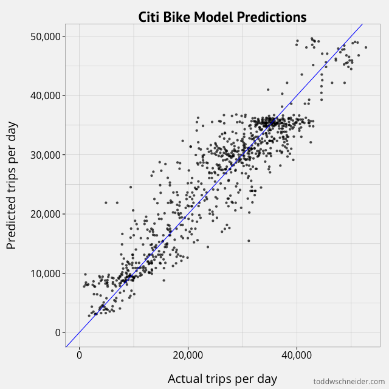

layout: true

`r paste0("
", params$event, " 

")` 

---

class: center, middle

### Esta apresentação online : `r paste0("http://datactivist.coop/", params$slug)`

Fontes : `r paste0("https://github.com/datactivist/", params$slug)`

As produções do Datactivist são livremente reutilizáveis nos termos da licença [Creative Commons 4.0 BY-SA](https://creativecommons.org/licenses/by-sa/4.0/legalcode.fr).

 
 

---
class:middle, center, inverse

# Antes de começar…
---

### .red[Dados], informações, conhecimentos

---
### De dados partilhados a .red[dados abertos]

---
### Para que serve dados abertos? .red[ em uma imagem]

---
class:middle,inverse,center

# Para que serve dados abertos?

# .red[...para transformar as organizações]
---

### .red[Valorizar o trabalho] de uma administração ou de uma empresa

[Gironde (França)](https://dtc-innovation.org/projects/gironde-dataviz)

---
### Servir o interesse geral através de .red[um serviço público]
.pull-left[

]
.pull-right[
* **Continuidade**: dados constantemente acessíveis e atualizados

* **Adaptabilidade**: dados adaptados à procura (formatos, natureza, serviços)

* **Igualdade** : dados acessíveis a todos, sem restrições ou discriminação			
]
			
---

### .red[Economia de tempo] entre departamentos diversos

Responder com menor frequência a pedidos individuais devido à publicação de dados	:		

---
### Abrir as possibilidades de .red[cruzamento de dados]

Exemplo de bicicletas self-service em Nova York: comparando modelos e usos

.pull-left[

]
.pull-right[

]

[FONTE](http://toddwschneider.com/posts/a-tale-of-twenty-two-million-citi-bikes-analyzing-the-nyc-bike-share-system/)

---
### Abrir as possibilidades de .red[cruzamento de dados]

Exemplo de [Dataviz Challenge na França](https://datactivist.coop/datavizchallenge/guide/docs/dataviz.html#defi-1-les-deplacements-en-cascade): prever o nível de mistura social nas escolas de acordo com a evolução dos cursos opcionais

.reduite[]

---

### Questionando .red[políticas públicas]

Exemplo de dataviz de bicicletas self-service sendo utilizadas :				

			
	

---
### Questionando .red[políticas públicas]

Exemplo de Toulouse, workshops de mapeamento de dados 	

			
[FONTE](https://hal.archives-ouvertes.fr/hal-01829319/document)

---
class:middle,inverse,center
# Para que serve dados abertos?

# .red[...melhorar os sistemas de dados e de informação]
---
### Melhorar a .red[qualidade dos dados]

+ Mais audiência 
+ correções
			

---

### Melhorar a .red[qualidade dos dados]
.pull-left[
Graças ao uso interno de dados
"Eat your own dog food": use os dados que você mesmo abre para os outros. 

]
				
.pull-right[

 
Graou : toda a informação para os maquinistas a partir dos dados abertos da sncf]
---
### Melhorar o .red[conhecimento dos sistemas de informação] 

.pull-left[
* Descubra novos dados

* Relance projetos de mapeamento de dados

* Identifique práticas a serem alteradas (armazenamento local, dados não utilizados ou nunca atualizados...)]

.pull-right[

]
---
### Revelando questões de .red[soberania relativa aos dados] 

.pull-left[
* Conheça os dados que você possui

* Saiba quem é responsável pela atualizações

* Saiba quais dados você não possui
* Crie links (API) com parceiros, delegados, fornecedores de serviços

* Negocie o acesso aos dados (troca)
]

.pull-right[
.reduite[]
]
---
class:inverse,middle,center

# Para que serve dados abertos?

# .red[...para melhor informar os cidadãos e a checagem de informações]

---
### Para a .red[transparência da ação pública]

			
		
---

### Ajudar os cidadãos na .red[compreensão de fenômenos complexos]

[USAFacts](https://usafacts.org) :

---
### Ajudar os cidadãos na .red[compreensão de fenômenos complexos]

[Issy les Moulineaux](http://rapportfinancier.issy.com) :

---

### Associar mais estreitamente .red[os cidadãos ao processo de consulta] 

[CartoQuartiers](https://www.cartoquartiers.fr) em Nantes: 

			
---
### Ser mais forte juntos, e ter .red[um controle maior dos nossos dados]

Open Street Map vs Google Maps: 

---
### Ser mais forte juntos, e ter .red[um controle maior dos nossos dados]

---
### Para a .red[ciência dos dados e o conhecimento aberto]  

[Data literacy](http://www.madebymany.com/stories/advancing-data-literacy) como pré-requisito
.center[.reduite[]]

---
### Para a .red[ciência dos dados e o conhecimento aberto]  

Exemplo da base de dados de acidentes rodoviários: 

---
### Para a .red[ciência dos dados e o conhecimento aberto]  
Exemplo da base de dados de acidentes rodoviários:

---
### Para a .red[jornalismo de dados]

.center[.reduite[]]
				
[source](https://www.nytimes.com/interactive/2018/03/19/upshot/race-class-white-and-black-men.html)

---
### Para a .red[jornalismo de dados]

				
---

### Para a .red[engajamento dos cidadãos]

---

### Para a .red[engajamento dos cidadãos]

.reduite[]

---
class:inverse,middle,center

# Para que serve dados abertos?

# .red[...para a criação de valor econômico e social]

---
### A abertura de dados é um .red[investimento de longo prazo] 

.center[.reduite[]]
---
### Permitir o desenvolvimento de .red[novos serviços]

[Chatbots](https://www.messenger.com/t/justinbikerclan) para encontrar uma bicicleta: 
				

---

### Permitir o desenvolvimento de .red[novos serviços]

[Hastes conectadas](https://www.data.gouv.fr/fr/posts/data-story-1-handisco-nancy/) para guiar pessoas cegas/deficientes visuais: 
				

---
### Permitir a integração de dados através de .red[aplicativos existentes]

Waze, maps, citymapper…

---
### Pela .red[atratividade do território]

.pull-left[Os serviços são instalados em cidades onde os dados estão disponíveis, completos e de alta qualidade.

Aumento dos serviços disponíveis nas cidades de média dimensão, ao mesmo nível que as metrópoles mundiais em termos digitais]

.pull-right[

]			
		
---

### Melhorar a .red[eficiência dos serviços ]

**Transport for London**
	
* Sem custos de investimento numa aplicação de rodovias: um ponto central

* Sem taxas de campanha nesses aplicativos

* A qualidade dos dados em tempo real tornou possível enviar menos alertas SMS aos usuários: £3M economizados por ano

* A melhor legibilidade da oferta da rede TfL tornou possível gerar mais viagens = £20M de lucros por ano

---
class:inverse,middle,center

# Para que serve dados abertos?

# .red[E muito mais...]

---

### Os dados abertos .red[beneficiam a todos]

.center[.reduite[]]

---
### É difícil conhecer .red[todos os usos dos dados abertos]
Nem todos os usuários são autenticados. Nem todos eles comunicam sobre os seus usos. 
.center[.reduite[]]

---
class: inverse, center, middle
  
# Obrigado !

Contact : [samuel@datactivist.coop](mailto:samuel@datactivist.coop)