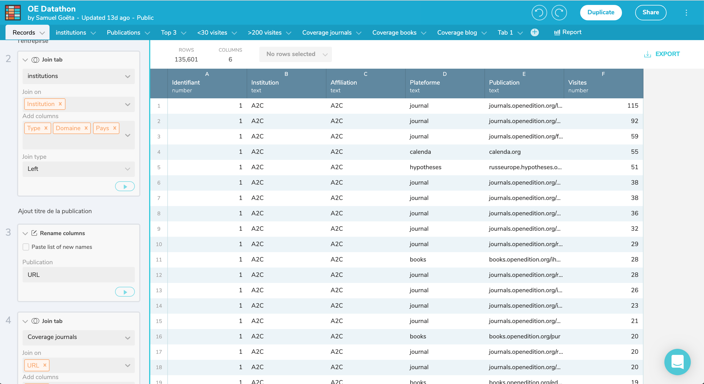

layout: true

`r paste0("
", params$event, " 

")` 

---

class: center, middle

### A apresentação está online em: `r paste0("http://datactivist.coop/", params$slug)`

Fontes : `r paste0("https://github.com/datactivist/", params$slug)`

As produções da Datactivist são livremente reutilizáveis nos termos da licença [Creative Commons 4.0 BY-SA](https://creativecommons.org/licenses/by-sa/4.0/legalcode.fr).

 
 

---
class: inverse, center, middle

# O ciclo da abertura de dados

---
### Open Data Pipeline: as principais etapas da abertura

.reduite[.pull-left[

]]

.pull-right[
A Open Data Pipeline é um modelo de processo de abertura de dados constituído em 7 etapas. 

Essas 7 etapas podem ter uma importância maior ou menor segundo os conjuntos de dados e os contextos organizacionais. 

As vezes é necessário voltar para obter a abertura de um conjunto de dados. 

**Objetivo**: compreender como acotece de modo geral a abertura de um conjunto de dados 
]
---
### A circulação dos dados provoca fricções

>Cada movimento de dados através de uma interface tem um custo em tempo, energia e atenção humana. Cada interface entre os grupos e as organizações, assim que com as máquinas, representa um ponto de resistência onde os dados podem ser sofrer um problema, serem mal interpretados ou perdidos. 
>Nos sistemas locais, a fricção dos dados consome energia e produz turbulência e calor - ou seja, conflitos, desacordos e processos indisciplinados e não necessariamente corretos.

Edwards, P. N. et al. (2011) [‘Science friction: Data, metadata, and collaboration’](https://journals.sagepub.com/doi/abs/10.1177/0306312711413314), _Social Studies of Science_, 41(5)

---
### Identificar

.pull-left[

]

.pull-right[
* Encontrar os servidores

* Estudar os dados por outros organismos

* Mapear os dados

* Documentar os dados

]

---
### O inventário: um processo de longo prazo

.pull-left[

]
.pull-right[
* A utopia do inventário exaustivo

* Um processo progressivo e explorador

* Pergunta: como qualificar os dados?

* Ligar aos processos de organização dos sistemas de informação

]

---
### Validar

.pull-left[

]

.pull-right[
* Avaliar os conjuntos de dados

* Priorizar a abertura 

* Validar a abertura pela hierarquia

]

---
### Algumas "boas razões organizacionais" para não abrir os dados

* Dados ocultos nos sistemas de informação: explorar as bases de dados, reconstruir os esquemas e extrair os dados

* Os dados que podem servir a utilizadores também podem servir a usuários mal-intencionados: prever os riscos e os perigos da abertura

* Os dados que não foram pensados para a abertura: melhorar a qualidade e a inteligibilidade 

* Os dados super "sensíveis" para serem abertos: a transparência, um mandato necessário 

---
### Editar

.pull-left[

]

.pull-right[
_data editing: as operações nas quais os estatísticos tratam e transformam os dados oriundos de fontes administrativas (Desrosières 2005) 

* Anonimizar 

* Retirar a sensibilidade dos dados que não podem ser publicados

* Tornar inteligível os acrônimos 

* Melhorar a qualidade dos dados

]

---
### A corrida pela qualidade dos dados da FING

Mais de 120 pontos de controle para verificar a qualidade dos dados

---
### [Dataproofer](http://dataproofer.org/): uma ferramenta de controle automática da qualidade

---
### [WTFCSV](https://databasic.io/en/wtfcsv/) para pré-visualizar e controlar um conjunto de dados

---
### [Workbench](workbenchdata.com) para transformar os dados

---
### Padronizar

.pull-left[

]

.pull-right[
* Converter os dados em um formato aberto (especificações técnicas públicas e sem restrições de acesso ou de colocação em prática) e lisível por máquinas

* Adotar especificações compartilhadas: GTFS, DECP, IATI, OCDS, base comum de dados locais...

* Transformar os dados

]

---
### Transformação em CSV: muito além do "salvar como"

.center[.reduite
]]

---
### Transformação em CSV: muito além do "salvar como"

.center[.reduite
]]
---
### Transformação em CSV: muito além do "salvar como"

.center[.reduite
]]

---
### Transformação em CSV: muito além do "salvar como"

.center[.reduite
]]

---
### Publicar

.pull-left[

]

.pull-right[
* Importar os dados no portal

* Descrever os campos do arquivo

* Documentar os metadados
]

---
### [Datasheet for Datasets](https://teamopendata.org/t/traduction-et-adaptation-du-modele-de-description-des-donnees-datasheet-for-datasets/1400): um modelo de documentação de dados

.reduite.center[

]

---
### Atualizar

.pull-left[

]

.pull-right[

* Atualizar manualmente ou automatizar a abertura

* Conservar os dados

* Levar em consideração o feedback dos usuários

]
---
### As chaves do sucesso

.pull-left[
- obter um apoio de alto nível

- configurar a organização para a abertura 

- facilitar a descoberta e a utilização dos dados 

- ficar a escuta e interagir com os usuátios]

.pull-right[

]
---
class: inverse, center, middle
  
# Obrigado !

Contact : [samuel@datactivist.coop](mailto:samuel@datactivist.coop)
